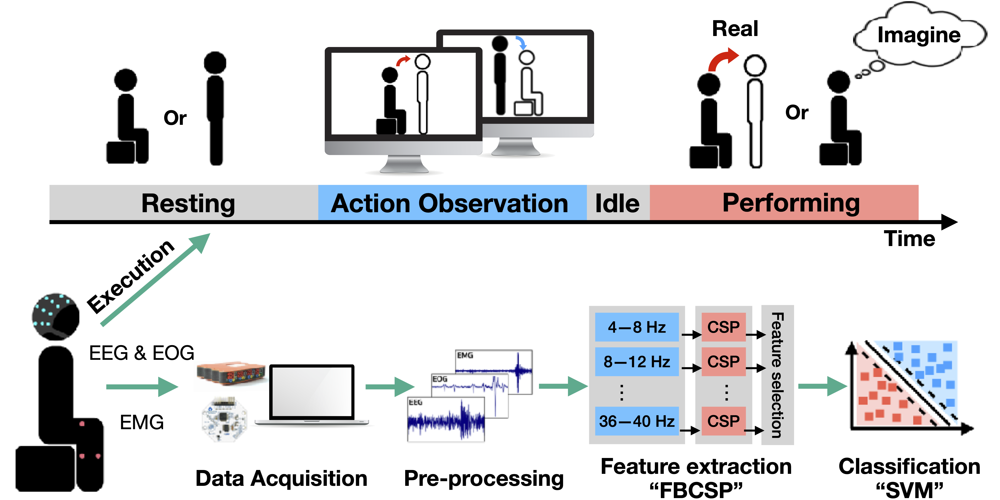
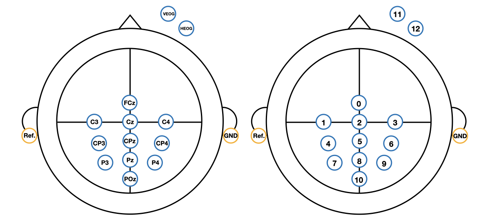
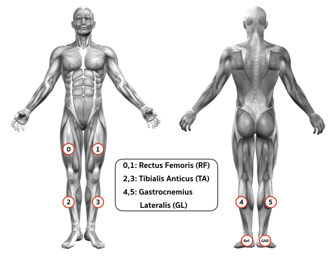

# Decoding EEG Rhythms During Action Observation, Motor Imagery and Execution for Standing and Sitting

 
 

## Abstract 
 Event-related desynchronization and synchronization (ERD/S) and movement-related cortical potential (MRCP) play an important role in brain-computer interfaces (BCI) for lower limb rehabilitation, particularly in standing and sitting. However, little is known about the differences in the cortical activation between standing and sitting, especially how the brain's intention modulates the pre-movement sensorimotor rhythm as they do for switching movements. In this study, we aim to investigate the decoding of continuous EEG rhythms during action observation (AO), motor imagery (MI), and motor execution (ME) for standing and sitting. We developed a behavioral task in which participants were instructed to perform both AO and MI/ME in regard to the actions of sit-to-stand and stand-to-sit. Our results demonstrated that the ERD was prominent during AO, whereas ERS was typical during MI at the alpha band across the sensorimotor area. A combination of the filter bank common spatial pattern (FBCSP) and support vector machine (SVM) for classification was used for both offline and classifier testing analyses. The offline analysis indicated the classification of AO and MI providing the highest mean accuracy at 82.73±2.54 % in stand-to-sit transition. By applying the classifier testing analysis, we demonstrated the higher performance of decoding neural intentions from the MI paradigm in comparison to the ME paradigm. These observations led us to the promising aspect of using our developed tasks based on the integration of both AO and MI to build future exoskeleton-based rehabilitation systems.
 
## Data Description

 
  
<b>Fig. 1</b> Timeline of each experimental trial. The four states displayed include resting (0–4 s), AO (4–8 s), idle (8–9 s), and task performing, either MI or ME (9–13 s). 

### Experimental protocol

To investigate the feasibility of decoding the MI signals (including ERD/S) and MRCPs during the intended movement executions with continuous EEG recordings, the entire experimental procedure composed of two sessions: MI and ME. Each session consisted of 3 runs (5 trials each), incorporating a total of 30 trials. The protocol began with a sitting posture, followed by 5 repeated trials of sit-to-stand and stand-to-sit tasks alternatively. Figure 1 displays the sequence of four states in each trial: R, AO, idle, and task performing states (MI or ME). During the R state, a black screen was displayed on the monitor for 6 seconds (s). The participants were instructed to remain relaxed and motionless. To avoid the ambiguity of the instructions, a video stimulus showing the sit-to-stand or stand-to-sit video task lasted for 4 to 5 s was presented to guide the participants in the AO state. The participants were instructed to perform the tasks of both sessions immediately after the audio cue. In the ME session, the participants were to complete a succession of self-paced voluntary movements after the audio cue. In the MI session, the participants were to commence the imagining of the assigned motion after the audio cue. During MI, the motor initiation onset can be generally obtained from an audio cue or visual cue, whereas during ME, the motor initiation onset from EMG signals.

 
  
<b>Fig. 2</b> The sensing system set up for EEG, EMG, and EOG data acquisition. 

### Data Acquisition
The sensing system was set up to record the EEG, EOG, and EMG signals simultaneously throughout the experiment, as depicted in  Figure 2.

 
 
  
<b>Fig. 3</b> The channel configuration of the International 10-20 system (11 EEG and 2 EOG recording electrodes). The left panel corresponding location of each electrode; The right panel indicates the indexing. 

#### EEG and EOG signals

* A _g.USBamp RESEARCH_ was used to recored EEG and EOG signals as displyed in Figure 3.
* The sampling rate was set at 1200 Hz.
* **EEG**: 11 electrodes were placed on *FCz*, *C3*, *Cz*, *C4*, *CP3*, *CPz*, *CP4*, *P3*, *Pz*, *P4*, and *POz*
* **EOG**: 2 electrodes were placed on under (*VEOG*) and next (*HEOG*) to the outer canthus of the right eye
* The impedance of both EEG and EOG signals was maintained at below 10 *k*Ω throughout the experiment
* EEG and EOG signals were provided on both MI and ME sessions
* The raw EEG and EOG on each sit-to-stand/stand-to-sit transition of MI/ME session were formed in a dimension of participants×runs×trials×channels×time points (8×3×5×6×16800).

 
  
<b>Fig. 4</b> The channel configuration of the 6 EMG recording electrodes, which shows the indexing corresponding location of each electrode. 

#### EMG signals
* An _OpenBCI_ was used to recorded EMG signals.
* The sampling rate was set at 250 Hz.
* 6 electrodes were placed on rectus femoris (*RF*), tibialis anticus (*TA*), and  gastrocnemius lateralis (*GL*) of two lower limbs as displyed in Figure 4.
* There was only recording EMGs on ME session
* The raw EMG of each sit-to-stand/stand-to-sit transition was formed in a dimension of participants×runs×trials×channels×time points (8×3×5×6×3500).

### Dataset

Raw dataset available on [Decoding-EEG-during-AO-MI-ME Pages](https://vistec-my.sharepoint.com/:f:/g/personal/1830808_vistec_ac_th/EryhjI8X11lDnQgDRp_zmyUBG7KzPPD-tsm--5lIASdM9A?e=nMl59s) \
(Paste dataset into folder: "pysitstand/raw_data") 

### Dependencies
* [MNE-Python](https://mne.tools/stable/index.html)
* [EEGLAB version eeglab2019_0](https://sccn.ucsd.edu/eeglab/index.php)\
(Paste EEGLAB into folder: "pysitstand/eeglab2019_0")
* [Riemannian Artifact Subspace Reconstruction Matlab Toolbox](https://github.com/s4rify/rASRMatlab)\
(Paste rASRMatlab and its dependencies into folder: "pysitstand/eeglab2019_0/plugins/rASRMatlab")

### Citation ###
When using (any part) of this dataset, please cite [our paper](https://arxiv.org/abs/2004.04107)

    @ARTICLE{9130151,  author={R. {Chaisaen} and P. {Autthasan} and N. {Mingchinda} and P. {Leelaarporn} and N. {Kunaseth} and S. {Tammajarung} and P. {Manoonpong} and S. C. {Mukhopadhyay} and T. {Wilaiprasitporn}},  journal={IEEE Sensors Journal},   title={Decoding EEG Rhythms During Action Observation, Motor Imagery, and Execution for Standing and Sitting},   year={2020},  volume={},  number={},  pages={1-1},}
