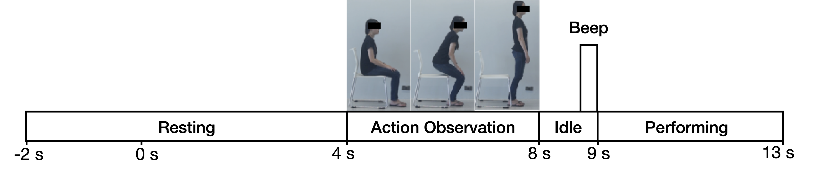

# Decoding EEG Rhythms During Action Observation, Motor Imagery and Execution for Standing and Sitting
## Abstract --> Event-related desynchronization and synchronization (ERD/S) and movement-related cortical potential (MRCP) play an important role in brain-computer interfaces (BCI) for lower limb rehabilitation, particularly in standing and sitting. However, little is known about the differences in the cortical activation between standing and sitting, especially how the brain's intention modulates the pre-movement sensorimotor rhythm as they do for switching movements. In this study, we aim to investigate the decoding of continuous EEG rhythms during action observation (AO), motor imagery (MI), and motor execution (ME) for standing and sitting. We developed a behavioral task in which participants were instructed to perform both AO and MI/ME in regard to the actions of sit-to-stand and stand-to-sit. Our results demonstrated that the ERD was prominent during AO, whereas ERS was typical during MI at the alpha band across the sensorimotor area. A combination of the filter bank common spatial pattern (FBCSP) and support vector machine (SVM) for classification was used for both offline and pseudo-online analysis. The offline analysis indicated the classification of AO and MI providing the highest mean accuracy at 82.73$\pm$2.38\% in stand-to-sit transition. The results were acceptable in comparison to the original FBCSP study of right hand and right foot activation classifications. By applying the pseudo-online analysis, we demonstrated the possibility of decoding neural intentions from the integration of both AO and MI. These observations led us to the promising aspect of using our developed tasks to build future exoskeleton-based rehabilitation systems.
## Data Description

### EEG and EOG signals
* A _g.USBamp RESEARCH_ was used to recored EEG and EOG signals.
* The sampling rate was set at 1200 Hz.
* **EEG**: 11 electrodes were placed on *FCz*, *C3*, *Cz*, *C4*, *CP3*, *CPz*, *CP4*, *P3*, *Pz*, *P4*, and *POz*
* **EOG**: 2 electrodes were placed on under (*VEOG*) and next (*HEOG*) to the outer canthus of the right eye
* The impedance of both EEG and EOG signals was maintained at below 10 *k*Ω throughout the experiment

### EMG signals
* test

## Experimental protocol
* test
